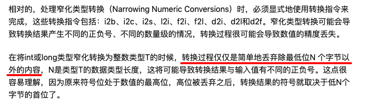

# jvm字节码学习实验报告

## 实验背景

前些天买了一本《深入理解JVM虚拟机》第三版，之前只看过前5章，刚好补了门票看后边的章节。
看到class字节码的部分，有一句话引起了我的注意
> 

感觉和直觉相悖，因此做了此实验，验证的同时，巩固一下对class文件的理解。

## 实验步骤

### vim简单编写了一个java文件

```
public class A {

    public static void main(String[] args) {
        int a = -1;
        byte b = (byte) a;
        System.out.println(b);
    }
}
```

### 编译并查看

查看class的结果如下

```
zsh> javap -verbose A.class
Classfile /Users/guoxiaodong/workspace/safehouse/A.class
  Last modified 2020-1-14; size 385 bytes
  MD5 checksum 9d5c848075956b4c3961a38b974ebfb8
  Compiled from "A.java"
public class A
  minor version: 0
  major version: 52
  flags: ACC_PUBLIC, ACC_SUPER
Constant pool:
   #1 = Methodref          #5.#14         // java/lang/Object."<init>":()V
   #2 = Fieldref           #15.#16        // java/lang/System.out:Ljava/io/PrintStream;
   #3 = Methodref          #17.#18        // java/io/PrintStream.println:(I)V
   #4 = Class              #19            // A
   #5 = Class              #20            // java/lang/Object
   #6 = Utf8               <init>
   #7 = Utf8               ()V
   #8 = Utf8               Code
   #9 = Utf8               LineNumberTable
  #10 = Utf8               main
  #11 = Utf8               ([Ljava/lang/String;)V
  #12 = Utf8               SourceFile
  #13 = Utf8               A.java
  #14 = NameAndType        #6:#7          // "<init>":()V
  #15 = Class              #21            // java/lang/System
  #16 = NameAndType        #22:#23        // out:Ljava/io/PrintStream;
  #17 = Class              #24            // java/io/PrintStream
  #18 = NameAndType        #25:#26        // println:(I)V
  #19 = Utf8               A
  #20 = Utf8               java/lang/Object
  #21 = Utf8               java/lang/System
  #22 = Utf8               out
  #23 = Utf8               Ljava/io/PrintStream;
  #24 = Utf8               java/io/PrintStream
  #25 = Utf8               println
  #26 = Utf8               (I)V
{
  public A();
    descriptor: ()V
    flags: ACC_PUBLIC
    Code:
      stack=1, locals=1, args_size=1
         0: aload_0
         1: invokespecial #1                  // Method java/lang/Object."<init>":()V
         4: return
      LineNumberTable:
        line 1: 0

  public static void main(java.lang.String[]);
    descriptor: ([Ljava/lang/String;)V
    flags: ACC_PUBLIC, ACC_STATIC
    Code:
      stack=2, locals=3, args_size=1
         0: iconst_m1
         1: istore_1
         2: iload_1
         3: i2b
         4: istore_2
         5: getstatic     #2                  // Field java/lang/System.out:Ljava/io/PrintStream;
         8: iload_2
         9: invokevirtual #3                  // Method java/io/PrintStream.println:(I)V
        12: return
      LineNumberTable:
        line 4: 0
        line 5: 2
        line 6: 5
        line 7: 12
}
SourceFile: "A.java"
```

### 实验结果

查看发现调用了```i2b```的指令，但是实际执行代码，print出来的b值还是-1。

### 结果分析

因为java里int是用补码来存储的， 因此```a=-1```， a存储的4个字节应该为```0xFFFFFFFF```，因此```i2b```后，b的一个字节应该是```0xFF```，因此还是-1。

因为int范围太大， 使用short可以更简单的计算字节码。
下边举几个short->byte丢失符号的例子:

1. 32767(0x7FFF) -> -1(0xFF)
2. -32767(0x8001) -> 1(0x01)
3. -32768(0x8000) -> 0(0x00) //补码里-0用来表示最大的负数

## 实验总结

1. 通过实验， 加深class文件结构的理解
2. 温习了补码的知识点
